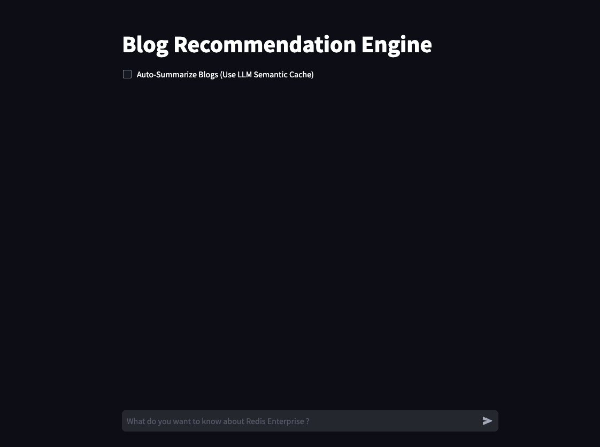
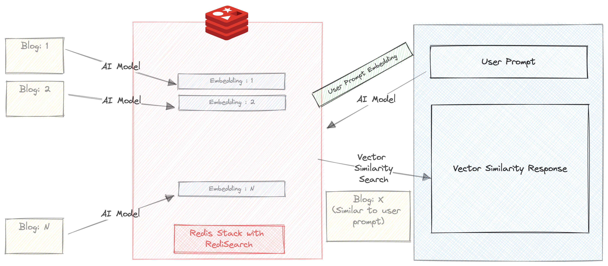
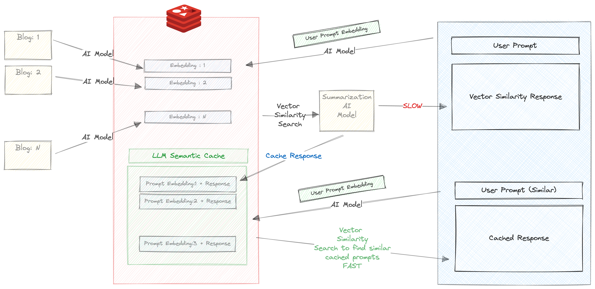

# A simple chatbot to demonstrate Retrieval Augmented Generation, Document Search, Semantic Caching, Recommendation systems

We build a chatbot which can summarize and recommend blogs on Redis.com website based on the user query.



This small project uses 2 AI models
- [all-mpnet-base-v2](https://huggingface.co/sentence-transformers/all-mpnet-base-v2)
- [BART (large-sized model), fine-tuned on CNN Daily Mail](https://huggingface.co/facebook/bart-large-cnn)

In this project, we aim to demonstrate
- Using Redis Vector Similarity Search, which works on the content of the data & helps us to find blogs with content similar to the prompt entered by the user
- Using Redis as a Semantic Cache, which again uses vector similarity, but in this case the similarity search works on the users previous questions which are cached in Redis. This gives us immense benefits in terms of efficency and blazingly fast responses to thousands of concurrent users who have similar questions

### Spin up a Redis instance enabled with RedisStack!

The easiest way to is to use a docker image using the below command
```bash
docker run -d -p 6379:6379 -p 8001:8001 redis/redis-stack:latest
```

If you do not want to use a docker image, you can sign up for a free Redis Cloud subscription [here](https://redis.com/try-free).

## Set up the project


Download the repository

```
git clone https://github.com/mar1boroman/redis-vector-db-usecases.git && cd redis-vector-db-usecases.git
```

Prepare and activate the virtual environment

```
python3 -m venv .env && source .env/bin/activate
```

Install necessary libraries and dependencies

```
pip install -r requirements.txt
```

## Step 1: Lets Extract the Blogs from the Redis official website. (Optional)

We have extensive knowledge base at [Redis Blog](https://redis.com/blog/)
Lets run the first script which is a webscraper, this script will scrape the website and create a CSV file containing the data of all the available blogs.

```bash
python 0_ext_redis_blogs.py
```
**Note**
_This repository already has the blogs updated till 19 September, 2023, running this script will only download the new blogs._
_The csv file is saved at [redis_blogs.csv](data/redis_blogs.csv)_

## Step 2: Run the CSV file through [all-mpnet-base-v2](https://huggingface.co/sentence-transformers/all-mpnet-base-v2)

In this step, we generate the embedding for text content of each blog and store them in a HASH format

```bash
python 1_load_redis_blogs.py
```

You can explore the content of your Redis Database in RedisInsight on your browser at http://localhost:8001

## Step 3

Now that we have stored the blogs and their embeddings in Redis, its time to see the chatbot in action!.

```
streamlit run 3_ui.py
```

### Step 3.1 - Auto Summarize OFF

Lets run a simple Vector similarity search over our blogs. 



**Make sure the 'Auto Summarize' checkbox is unchecked**

Enter a prompt. For e.g.
```
Triggers and Functions
```

You will get 3 blog recommendations within milliseconds. The response also includes the time taken to return the response.
In this case, the search happens entirely in redis, except that the prompt is run through [all-mpnet-base-v2](https://huggingface.co/sentence-transformers/all-mpnet-base-v2) before running the similarity search


### Step 3.2 - Auto Summarize ON

Lets get a little more advanced.



**Make sure the 'Auto Summarize' checkbox is checked**

Enter a prompt. For e.g.
```
Triggers and Functions
```

When you enter this prompt for the first time, the following things will happen

- The prompt is run through [all-mpnet-base-v2](https://huggingface.co/sentence-transformers/all-mpnet-base-v2)
- Similarity search between the prompt's embedding and the embeddings stored in Redis will yield 3 Blog recommendations
- The text content of all the three blogs recommended by previous step is run through [BART (large-sized model), fine-tuned on CNN Daily Mail](https://huggingface.co/facebook/bart-large-cnn) summarizer to generate a short summary of each of the blogs
- The 3 Blog recommendations, along with their summaries are sent back the the chatbot.

**This takes a considerably long time, about 30 s**

Hence, we store the response and the prompt in redis.
Check your RedisInsight in browser and you will see a key created with the prefix **llm_cache**

Once the response it returned, the prompt and response are cached, and more importantly **The prompt is run through [all-mpnet-base-v2](https://huggingface.co/sentence-transformers/all-mpnet-base-v2) and its corresponding embedding is also cached**

Now try running the same prompt (or similar prompt again). For e.g. 

```
About Triggers and functions
```

You will get the cached response based on the blazingly fast vector similarity search between the prompts embedding and the response that was cached in the previous step.

We can clearly see the benefits of using Semantic Caching here
- The time taken to respond to similar queries is reduced exponentially
- You don't have to go back to the AI model to generate summaries for similar queries. (Save some tokens!)
- The cached response can serve multiple thousands of concurrent users (Save even more tokens!)


## Step 4 (Optional)

A version of the chatbot is available in CLI version

```bash
python 2_vecsim_redis_blogs.py
```