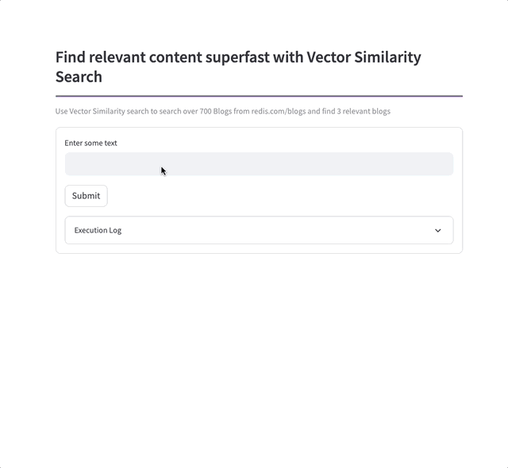
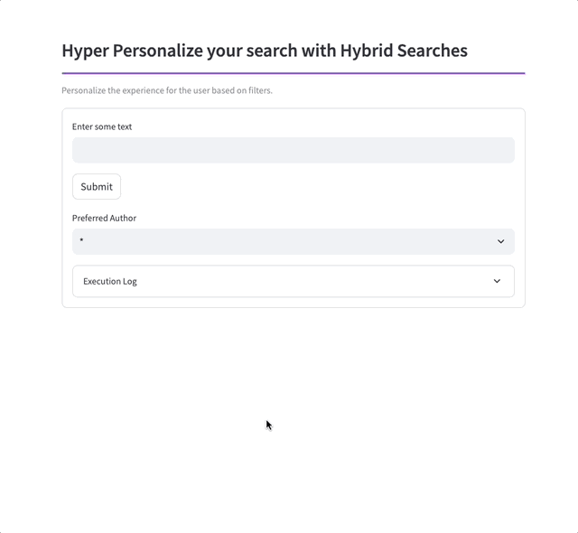
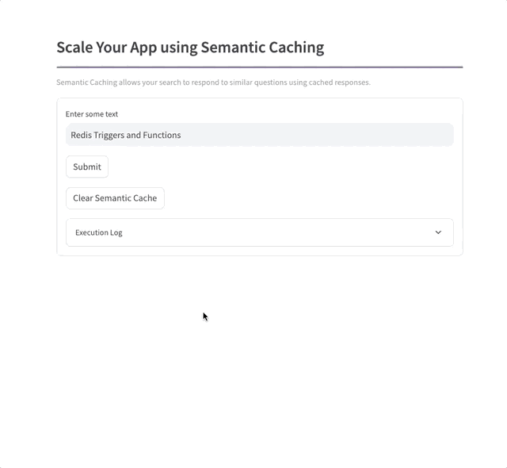
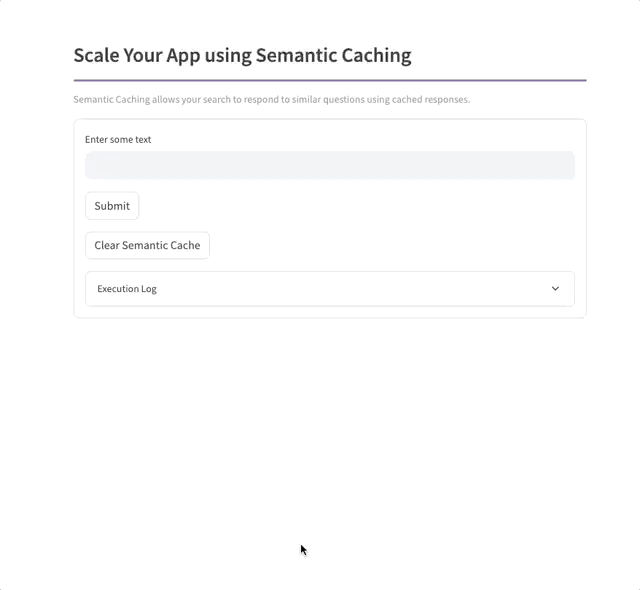
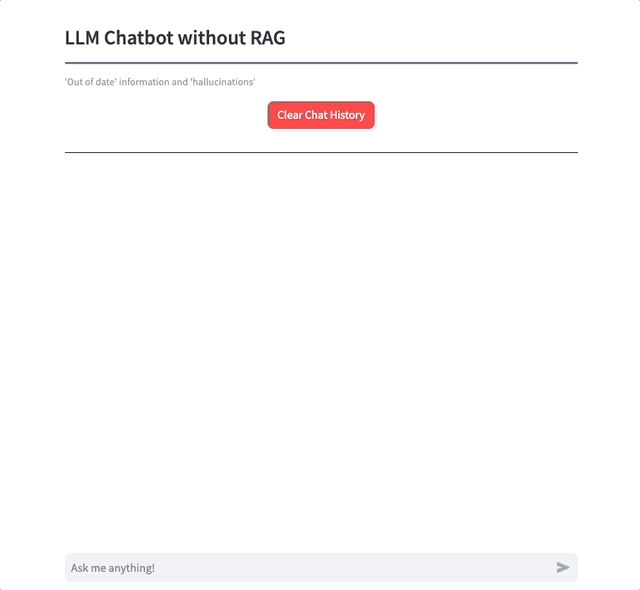
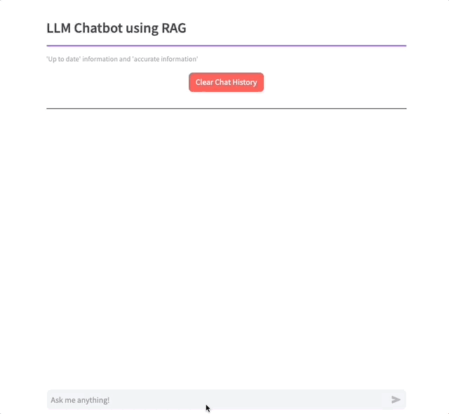

<div align="center">
    <a href="https://github.com/mar1boroman/redis-vector-db-usecases"></a>
    <br />
    <br />
<div display="inline-block">
    <a href="https://redis.io/docs/stack/search/reference/vectors/"><b>Redis VSS Documentation</b></a>&nbsp;&nbsp;&nbsp;
  </div>
    <br />
    <br />
</div>

# Redis Vector Database Demo Application

This demo showcases the vector search similarity (VSS) capability within Redis Stack and Redis Enterprise.
Through the RediSearch module, vector types and indexes can be added to Redis. This turns Redis into
a highly performant vector database which can be used for all types of applications.

We explore 4 specific areas of the 'vector database' use cases
### 1. Vector Similarity Search


### 2. Recommendation Engine (Hybrid search - Meta + Vectors)


### 3. Semantic Caching

#### 3.1 Response without Semantic Caching



#### 3.2 Response without Semantic Caching



### 4. RAG Models for LLM bots

#### 4.1 Response without RAG



#### 4.1 Response with RAG




# About the demo

Redis has a vast repository of about 700 blogs.
We will use this demo to show how to build vector search engine to search through this repository of blogs.
We will also explore how to turn document search into a recommendation engine & how to use this repository of blogs
in a RAG model to supercharge your LLM.


## Project Setup

### Spin up a Redis instance enabled with RedisStack!

The easiest way to is to use a docker image using the below command
```bash
docker run -d -p 6379:6379 -p 8001:8001 redis/redis-stack:latest
```

If you do not want to use a docker image, you can sign up for a free Redis Cloud subscription [here](https://redis.com/try-free).

###  Set up the project

Download the repository

```
git clone https://github.com/mar1boroman/RedisVectorXperience.git && cd RedisVectorXperience
```
Prepare and activate the virtual environment

```
python3 -m venv venv && source venv/bin/activate
```

Install necessary libraries and dependencies

```
pip install -r requirements.txt
```

**Configure your OPEN AI Key in the .env file**

```
vi .env
```


### Extract & Update the blogs and store in a CSV file (Optional - Dont run if not necessary)

```
python 1_private_docs/update_redis_blogs.py
```

This script will update the blog entries in the [redis_blogs.csv](./1_private_docs/redis_blogs.csv) file
Currently the data is updated till Oct 9, 2023.

### Generate the embeddings and store in a CSV file (Optional - Dont run if not necessary)

If you run this step, please make sure you delete the existing [redis_blogs_with_embeddings.csv](2_generate_embeddings/redis_blogs_with_embeddings.csv) with pre generated embeddings.

```
python 2_generate_embeddings/gen.py
```

This script will read the entries from [redis_blogs.csv](./1_private_docs/redis_blogs.csv) file and generate embeddings for every record using OPEN AI model.
This repository already includes the file [redis_blogs_with_embeddings.csv](2_generate_embeddings/redis_blogs_with_embeddings.csv) with pre generated embeddings.
Currently the data is updated till Oct 9, 2023.

### Load the embeddings into Redis database

Assuming you already have a redis database running (redis-stack  or redis enterprise), execute the below script to load the data into redis.

```
python 3_load_embeddings/load.py -reload
```
This script will
- Load all the documents and their respective embeddings into redis
- Create a index on all these documents to enable vector search
- Create a index to enable semantic search in the future

## Run the Application!

Run the UI to explore all 4 use cases.

```
streamlit run 4_ui/0_🔍_Vector_Search.py
```
